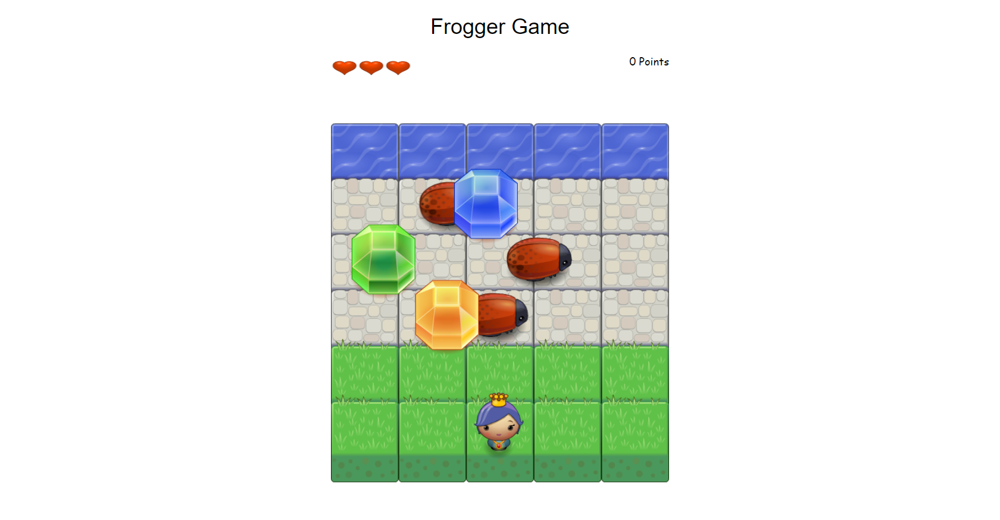
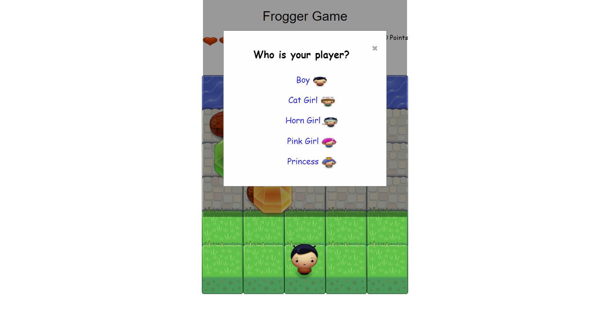

# Classic Arcade 'Frogger' Game

## Description
The Frogger Game is a complete browser-based game based on a 1981 arcade game developed by Konami. It is regarded as a classic from the golden age of video arcade games, noted for its novel gameplay and theme.

## Objective of Game
In this game, there is a Player and Enemies (bugs). The goal of the player is to move from grass area to reach the water without colliding into any one of the enemies. Along the way, player can pick up gemstones that increases Player's score. Player is given 3 lives (Hearts) and lose a life and points when Player collides with an enemy.

:+1:Once Player reaches the water (i.e., the top of the game board) and all gemstones are collected, the game is won.

### How to play?
- User can pick an avatar to represent Player.

- User can move Player left, right, up and down.
- User avoids enemies (bugs) that move at varying speeds on the paved block portion of the game board.
- Once Player collides with an enemy (bug), the game is reset and Player moves back to the starting square.

:+1:The game ends if all Hearts are gone but gemstones have not all been collected.

## Dependencies
None
